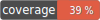
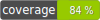

## Coverage
[](https://github.com/flagship-io/flagship-php-sdk-dev/actions/workflows/CI_PHP_5_4.yml) 
[](https://github.com/flagship-io/flagship-php-sdk-dev/actions/workflows/CI_PHP_5_6.yml) 
[](https://github.com/flagship-io/flagship-php-sdk-dev/actions/workflows/CI_PHP_7.4.yml) 
[](https://github.com/flagship-io/flagship-php-sdk-dev/actions/workflows/CI_PHP_8.yml) \
**PHP 5.4**  
**PHP 5.6**  
**PHP 7.4**  
**PHP 8** 
## Usage
```php
require __dir__ . '/vendor/autoload.php';

use Flagship\Flagship;

Flagship::start('envId', 'apiKey');

$visitor = Flagship::newVisitor('visitorId',['contextKey'=>'contextValue']);

if ($visitor) {

    $visitor->synchronizedModifications();

    echo $visitor->getModification('key', 'defaultValue') . "\n";
}
```